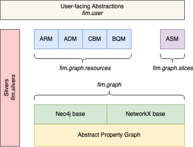

[](https://requires.io/github/fabric-testbed/InformationModel/requirements/?branch=master)

[](https://pypi.org/manage/project/fabric-fim/releases/)

# Information Model

## Basic Graph Abstractions

FABRIC Information Model library, containing class definitions and methods for operating
on different types of information model representations (sliver and slice). 

The implementation covers the following models and model transformations: 
- ARM (Aggregate Resource Models) - generated by aggregate owner, may contain multiple resource delegations intended
  for different brokers
- ADM (Aggregate Delegation Model) - a single ARM may be partitioned into one or more ADMs intended for different 
  brokers
- CBM (Combined Broker Model) - multiple ADMs sent to a broker from different aggregates are merged into a single CBM.
If needed ADMs can be 'unmerged' from a CBM (when e.g. an aggregate goes off-line)
- BQM (Broker Query Model) - multiple types of BQMs can be produced by a broker in response to `listResources`-like 
queries from the information contained in CBM and live allocation information stored by the Broker. 
The returned models can contain different levels of details of resources. BQMs can be used by user tools, 
  portals or other entities which need to inspect available testbed resources
- ASM (Abstract Slice Mode) - model generated by user tools, passed to the Orchestrator, which describes a slice 
  topology. This model can be annotated by Orchestrator and Aggregate Managers with details of the provisioned (vs.
  requested) infrastructure and returned back to the user. ASMs encompass what is commonly referred to as Slice Request
  and Slice Manifest. 
  
These models are based on a common framework of Abstract Property Graph class `fim.graph.abc_property_graph.py`, which are
then subclassed into a NetworkX-based implementation and a Neo4j-based implementation of abstract functionalities. 
Further types of models are built on top of these two implementations, thus allowing for easy interchange of the 
underlying graph implementation - in-memory (via NetworkX) or persistent (via Neo4j). 

There is a generic graph validation framework built-in - validation is stronger/more thorough when operating on Neo4j 
implementations due to stronger expressivity of Neo4j Cypher query language. Graph validation rules can be found under
`fim.graph.data`. 

ARM, ADM, CBM definitions and implementations can be found under `fim.graph.resources`, ASM - under `fim.graph.slices`.
Abstract definitions of BQM are found under `fim.graph.resources`, however multiple subtypes of BQM (with different
levels of topology details presented to the requestor). Generation of different types of BQMs is done via broker plugins
intended to be external to FIM (perhaps inside the Control Framework). See `fim.pluggable.py` for more details on 
plugins.

## Higher-level Abstractions

On top of basic property graph models described above, FIM offers additional more convenient abstractions that 
interchangeably use the property graph implementations (NetworkX or Neo4j) underneath to allow for easier manipulation,
inspection of data. 

The main set of abstractions is implemented under `fim.user` package, which provides 
[additional documentation](fim/user/README.md).

Supporting intermediate models are implemented under `fim.sliver`, however these models are largely internal to FIM and
Control Framework, and generally are not exposed to end-users. 

## Structure of the code

This figure reflects the overall structure of the code:



Follow this link into [fim/README.md](fim/README.md) to explore.

## Development environment

The recommended way is to set up your development environment using `virtualenv` after checking
out the code:
```bash
$ git clone git@github.com:fabric-testbed/InformationModel.git
$ cd InformationModel
$ mkvirtualenv -r requirements.txt infomodel
$ workon infomodel
(infomodel) $
```

Depending on which parts of FIM you are developing you may need to have 
[Neo4j-APOC docker container](https://github.com/fabric-testbed/fabric-docker-images/tree/master/neo4j-apoc) running.
Working on any models whose names start with `Neo4j` generally requires using the Neo4j Docker.

Models which start with `NetworkX` operate on in-memory models using NetworkX toolkit and don't require the Neo4j Docker.
Higher-level abstractions under `fim.user` can all be debugged and tested with in-memory NetworkX models, although they
operate on both types of models, depending on the situation.

Follow the instructions with the container to start it. 

## Installation

Multiple installation options possible. For CF development the recommended method is to
[install from GitHub MASTER branch](https://codeinthehole.com/tips/using-pip-and-requirementstxt-to-install-from-the-head-of-a-github-branch/):
```bash
$ pip install git+https://github.com/fabric-testbed/InformationModel.git
```

For developing and testing the FIM code itself use editable install (from top-level directory)
```bash
(infomodel) $ pip install -e .
```

For inclusion in tools, etc, use PyPi 
```bash
$ pip install fabric-fim
```

## Test Graphs

### Original Test Graphs

Original test graphs are located under [tests/models](tests/models). All graphs were created using 
[yEd](https://www.yworks.com/products/yed)
desktop graph editor (note that on-line version does not provide the same flexibility for creating custom node
and link properties).

### Generating New Test Graphs

Depending on the type of graph, many test graphs can be generated using higher-level abstraction libraries. 

For example ASMs can be generated starting from `fim.user.topology.ExperimentTopology` object, while ARMs can be
generated using `fim.user.topology.SubstrateTopology`. Other models are generally derived from these types of models,
as described in the overview. 

Test graphs are generated by unit tests:
- ASMs are generated in `test/slice_topology_test.py`
- ARMs are generated in `test/substrate_topology_test.py`
- ARM-ADM-CBM operations are tested in `test/zz_neo4j_pg_test.py` based on serializations produced in 
  `test/substrate_topology_test.py`.

## Testing

Run pytest

```bash
$ pytest [-s] test
```

This will produce substrate ARM models and save them into file in project root folder.
These tests require Neo4j docker running to support tests of Neo4j-implemented models.

## Graph validation

All graphs loaded into Neo4j (whether from files or being passed in as part of query or delegation) 
must conform to a set of rules expressed as Cypher queries. The basic set of rules for all 
types of graphs are located in [fim/graph/graph_validation_rules.json](fim/graph/data/graph_validation_rules.json).

Prior to ingestion graphs are also tested on general syntax validity of JSON-formatted fields.  

Additional rule files specific to model types may govern the validity of specific models.

NetworkX-based graphs also undergo validation, but more limited in scope due to lack of tools.

## Using fim_util.py utility

The utility supports a number of operations on GraphML files - enumerating nodes (for graphs)
coming out of yEd, loading into an instance of Neo4j, deleting graphs from Neo4j.

Start the [Neo4j-APOC docker container](https://github.com/fabric-testbed/fabric-docker-images/tree/master/neo4j-apoc)

Create fim_config.yaml with the following structure under `util/`:
```
# default fim_config configuration file for FIM utilities
neo4j:
  url: neo4j://0.0.0.0:7687
  user: neo4j
  pass: password
  import_host_dir: /host/directory/seen/by/neo4j/docker/as/imports
  import_dir: /imports
```
Parameters `password` and `import_host_dir` depend on how the Docker container is started in
the procedure above. Other parameters should remain unchanged from what is shown. 

Run the utility for detailed help for the various operations:
```
(infomodel) $ python fim_util.py -h
```

Generally the utility is good for e.g. loading a graph file: `python fim_util.py -l -f -r <graphml file>` or
merging multiple advertisements: `python fim_util.py -m -f <file1> -f <file2>`. Most options take multiple `-f`
and related options so can e.g. load multiple files at once.

## Neo4j Performance Considerations
For performance reasons it is critical that every instance of Neo4j has appropriate indexes created. 
Neo4j label `GraphNode` is hard-coded within FIM - every graph node has this label and another label is created
from the Class property and is meaningful to FIM. 
This is done for performance reasons to make it easier to create indexes and query models using those indexes.

The following indexes are required (indexes are created automatically by Neo4jGraphImporter whenever it is used):
```
CREATE INDEX graphid FOR (n:GraphNode) ON (n.GraphID)
CREATE INDEX graphid_nodeid FOR (n:GraphNode) ON (n.GraphID, n.NodeID)
CREATE INDEX graphid_nodeid_type FOR (n:GraphNode) ON (n.GraphID, n.NodeID, n.Type)
CREATE INDEX graphid_type FOR (n:GraphNode) ON (n.GraphID, n.Type)
```
Available indexes can be checked via console by using the `:schema` command. 

An index can be dropped using the following command (substitute appropriate index name):
```
DROP INDEX graphid
```

See [additional documentation](https://neo4j.com/docs/cypher-manual/current/administration/indexes-for-search-performance/).
